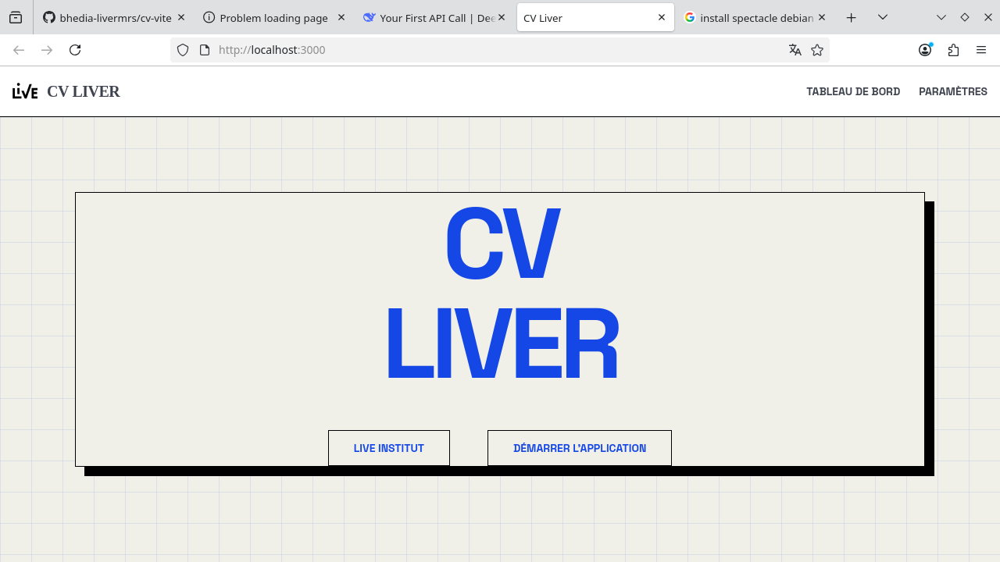

# CV Liver



**CV Liver** est une application web puissante conçue pour analyser, comparer et optimiser vos CV et lettres de motivation. En tirant parti de l'intelligence artificielle, l'application vous permet de faire correspondre vos compétences avec les exigences des offres d'emploi, maximisant ainsi vos chances de réussite.

## Fonctionnalités Principales

- **Analyse de CV** : Extraction intelligente des données depuis vos documents PDF et DOCX.
- **Correspondance IA** : Comparaison de profils candidats avec des descriptions de postes grâce à une intégration robuste des LLM.
- **Éditeur Riche** : Prévisualisation et édition de documents directement dans une interface moderne.
- **Interface Utilisateur Moderne** : Une navigation fluide et intuitive conçue avec Next.js et Tailwind CSS.

## Stack Technique

### Frontend
- **Framework** : [Next.js](https://nextjs.org/) (React)
- **Style** : [Tailwind CSS](https://tailwindcss.com/)
- **Interactions** : [dnd-kit](https://dndkit.com/) pour les composants glisser-déposer
- **Éditeur de texte** : [Tiptap](https://tiptap.dev/)

### Backend
- **Framework** : [FastAPI](https://fastapi.tiangolo.com/) (Python 3.13+)
- **Intégration LLM** : [LiteLLM](https://litellm.vercel.app/) (Supporte de multiples fournisseurs comme OpenAI, Anthropic, Gemini, Deepseek, Ollama, etc.)
- **Traitement de documents** : [Playwright](https://playwright.dev/), [PDFMiner](https://pdfminersix.readthedocs.io/), `python-docx`
- **Base de données** : [TinyDB](https://tinydb.readthedocs.io/) pour un stockage local et léger

## Démarrage Rapide

### Avec Docker (Recommandé)

Le moyen le plus simple de lancer CV Liver est d'utiliser Docker :

```bash
docker-compose up -d
```

L'application sera alors accessible sur `http://localhost:3000`.

### Installation Manuelle

**1. Lancer l'API Backend**

Assurez-vous d'avoir Python 3.13+ installé.

```bash
cd apps/backend
pip install .
uvicorn app.main:app --reload --port 8000
```

L'API sera disponible sur `http://localhost:8000`.

**2. Lancer l'Application Frontend**

Assurez-vous d'avoir Node.js (version 18+) installé.

```bash
cd apps/frontend
npm install
npm run dev
```

Rendez-vous sur `http://localhost:3000` pour utiliser l'application.

## ⚙️ Configuration de l'IA

Vous pouvez configurer votre fournisseur LLM (OpenAI, Anthropic, Ollama, etc.) directement via l'interface utilisateur (dans les paramètres) ou en définissant les variables d'environnement dans un fichier `.env` à la racine (voir `docker-compose.yml` pour les variables disponibles telles que `LLM_PROVIDER`, `LLM_API_KEY`, etc.).

## 📄 Licence

Ce projet est sous licence. Consultez le fichier [LICENSE](./LICENSE) pour plus de détails.
